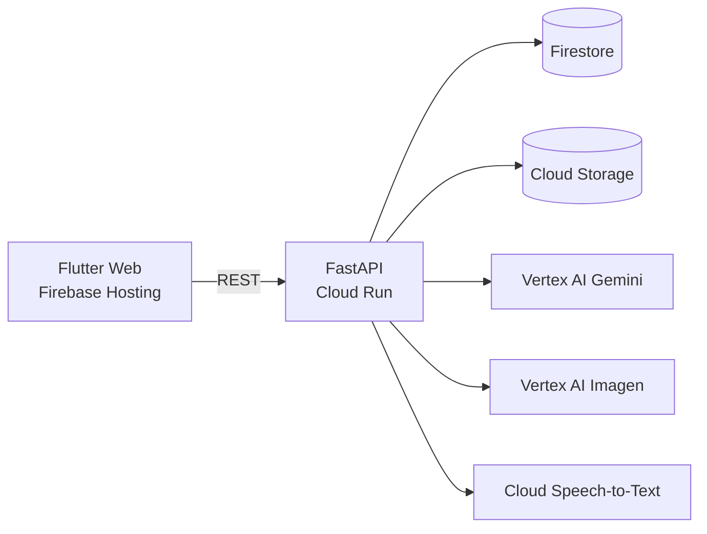

# AI Artisan Marketplace

An AI-powered marketplace that helps local Indian artisans sell online. Artisans upload a phone photo, a rough description, and a spoken story about their craft. The app turns these into a professional product listing and gives data-driven sales coaching.

Built for the **Gen AI Exchange Hackathon** with FastAPI on Cloud Run, Flutter Web, and Vertex AI.

<!-- Add 2–3 screenshots or a short GIF here: the dashboard, an "Enhance with AI" before/after, and an image-cleanup before/after. Drag images into GitHub's web editor to upload them. -->

## What it does

| Feature | How it works |
|---|---|
| **AI listing writer** | Gemini rewrites a rough description into an SEO-ready title, short and long descriptions, bullet points, tags, and image alt text, using craft-specific terms like Banarasi, Ajrakh, or Dhokra. |
| **Studio product photos** | Vertex AI Imagen removes the photo's background, then places the product on a clean studio gradient with a soft shadow. |
| **Speech-to-pitch** | Cloud Speech-to-Text (Indian English) transcribes the artisan's recorded story; Gemini turns it into a pitch title, story, and key points. |
| **AI sales coach** | Order data from Firestore is summarised and sent to Gemini, which returns pricing, bundling, SEO, seasonal and festival-promotion (Diwali, Rakhi, Eid, wedding season), and inventory advice. |
| **Orders & stats** | Revenue, orders, items sold, average order value, and top products over any time window. |

## Architecture



## Tech stack

- **Backend:** Python, FastAPI, Uvicorn
- **Frontend:** Flutter (Web)
- **Google Cloud:** Vertex AI (Gemini 2.0 Flash, Imagen), Speech-to-Text, Firestore, Cloud Storage, Cloud Run, Identity Platform
- **Hosting:** Firebase Hosting

## Project structure

```
.
├── main.py            # FastAPI backend (deployable to Cloud Run)
├── requirements.txt   # Backend dependencies
├── .env.example       # Environment variable template
├── lib/               # Flutter app source
├── web/               # Flutter web entry point
├── test/              # Flutter tests
├── pubspec.yaml       # Flutter dependencies
├── firebase.json      # Firebase Hosting config
└── android/ ios/ linux/ macos/ windows/   # Flutter platform folders
```

## Getting started

### Prerequisites
- Python 3.10+
- Flutter SDK
- A Google Cloud project with Vertex AI, Speech-to-Text, Firestore, and Cloud Storage enabled, plus a service-account key

### 1. Clone

```bash
git clone https://github.com/Blacknix809/artisan-marketplace-ai.git
cd artisan-marketplace-ai
```

### 2. Backend

```bash
python -m venv .venv
source .venv/bin/activate        # Windows: .venv\Scripts\activate
pip install -r requirements.txt
cp .env.example .env             # then fill in your own values
uvicorn main:app --reload --port 8000
```

Interactive API docs: http://127.0.0.1:8000/docs

### 3. Frontend

```bash
flutter pub get
flutter run -d chrome
```

To deploy: `flutter build web` then `firebase deploy`.

## Environment variables

| Variable | Description |
|---|---|
| `GOOGLE_APPLICATION_CREDENTIALS` | Path to your service-account key file |
| `PROJECT_ID` | Your Google Cloud project ID |
| `LOCATION` | Vertex AI region (default `us-central1`) |
| `BUCKET_NAME` | Cloud Storage bucket for product images |

## API

| Method | Endpoint | Description |
|---|---|---|
| POST | `/upload/image` | Upload a product image to Cloud Storage |
| POST | `/ai/enhance-description` | Generate an optimised listing from a rough description |
| POST | `/ai/clean-image` | Remove the background and create a studio-style photo |
| POST | `/ai/speech-to-pitch` | Turn a recorded story into a transcript and sales pitch |
| GET | `/stats/overview?days=30` | Orders, revenue, items sold, AOV, top products |
| GET | `/ai/analysis?days=30` | Stats plus Gemini coaching recommendations |

## Estimated pilot cost (India)

| Service | Pilot cost (₹) |
|---|---|
| Identity Platform | 0 |
| Firestore | 1,500 |
| Cloud Storage | 200 |
| Vertex AI Gemini | 2,000 |
| Vertex AI Imagen | 9,000 |
| Speech-to-Text | 100 |
| Cloud Run | 300 |
| **Total** | **~13,100** |

## Demo limitations

- **Authentication is disabled** for the hackathon demo, and all requests run as a single demo user. Identity Platform token verification is already implemented in `verify_identity_token()` in `main.py` and can be switched on per route.
- **Uploaded images are made public** for simplicity. A production version should serve them through signed URLs.
- **CORS allows all origins.** This should be restricted to the frontend's domain.

## Team

- Ananya Baweja (Team Lead)
- Aryan Kanungo
- Soha Chand
- Kartik Agrawal: sole developer of the FastAPI backend (all API endpoints and the Gemini, Imagen, Speech-to-Text, Firestore, and Cloud Storage integrations)
- Atharv Dixit
